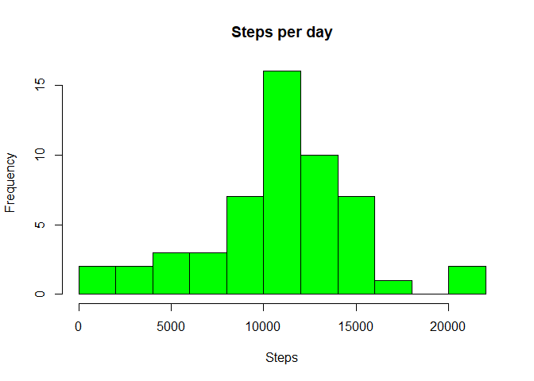
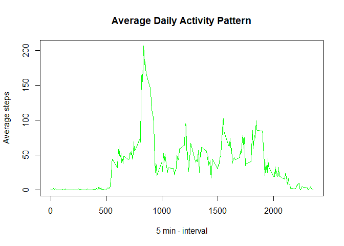
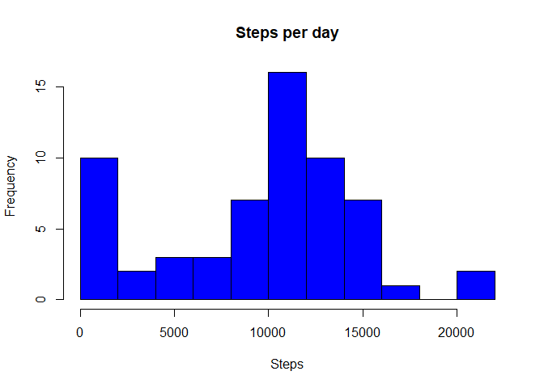
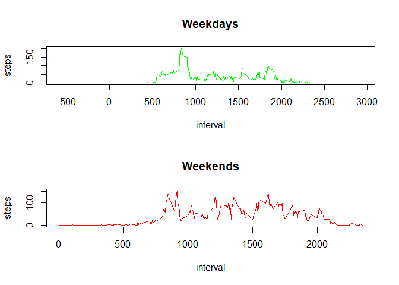

## Loading and preprocessing the data
The variables included in this dataset are:

1. **steps**: Number of steps taking in a 5-minute interval (missing values are coded as NA ) 
2. **date**: The date on which the measurement was taken in YYYY-MM-DD format 
3. **interval**: Identifier for the 5-minute interval in which measurement was taken

Next, I will read this data into a dataframe and inspect the structure of the data

```r
data = read.csv(unz("activity.zip", "activity.csv"))
names(data)
```

```
## [1] "steps"    "date"     "interval"
```

```r
str(data)
```

```
## 'data.frame':	17568 obs. of  3 variables:
##  $ steps   : int  NA NA NA NA NA NA NA NA NA NA ...
##  $ date    : chr  "2012-10-01" "2012-10-01" "2012-10-01" "2012-10-01" ...
##  $ interval: int  0 5 10 15 20 25 30 35 40 45 ...
```

```r
head(data)
```

```
##   steps       date interval
## 1    NA 2012-10-01        0
## 2    NA 2012-10-01        5
## 3    NA 2012-10-01       10
## 4    NA 2012-10-01       15
## 5    NA 2012-10-01       20
## 6    NA 2012-10-01       25
```


## What is mean total number of steps taken per day?
Calculate the total number of steps taken per day:


```r
stepsPerDay <- aggregate(steps ~ date, data, sum)
hist(stepsPerDay$steps, main = "Steps per day", xlab = "Steps", col = "green", breaks = 8)
```

<!-- -->


Calculate the mean and median of the total number of steps taken per day:


```r
meanStepsPerDay <- mean(stepsPerDay$steps)
medianStepsPerDay <- median(stepsPerDay$steps)
```
The mean is 10766.19  
The median is 10765  


## What is the average daily activity pattern?

A time series plot of the 5-minute interval (x-axis) and the average number of steps taken, averaged across all days (y-axis):

```r
stepsInterval <- aggregate(steps ~ interval, data, mean)
plot(stepsInterval$interval, stepsInterval$steps, type="l", xlab = "5 min - interval", ylab = "Average steps", main = "Average Daily Activity Pattern", col = "green")
```

<!-- -->

Interval from 5-minute intervals, on average across all the days in the dataset, contains the maximum number of steps:  

```r
stepsInterval$interval[which.max(stepsInterval$steps)]
```

```
## [1] 835
```
## Imputing missing values
The total number of missing values in the dataset is:  

```r
nrow(data[is.na(data$steps),])
```

```
## [1] 2304
```
Filling in all of the missing values in the dataset. Create a new dataset that is equal to the original dataset but with the missing data filled in.  

```r
dataWithoutNAs <- data
dataWithoutNAs[is.na(dataWithoutNAs$steps), "steps"] <- 0
```
Calculate the total number of steps taken per day:

```r
stepsPerDayNoNAs <- aggregate(steps ~ date, dataWithoutNAs, sum)
hist(stepsPerDayNoNAs$steps, main = "Steps per day", xlab = "Steps", col = "blue", breaks = 8)
```

<!-- -->

Calculate the mean and median of the total number of steps taken per day:


```r
meanStepsPerDayNoNAs <- mean(stepsPerDayNoNAs$steps)
medianStepsPerDayNoNAs <- median(stepsPerDayNoNAs$steps)
```

The mean is 9354.23  
The median is 10395

## Are there differences in activity patterns between weekdays and weekends?

Create a new factor variable in the dataset with two levels ? ?weekday? and ?weekend? indicating whether a given date is a weekday or weekend day.
0 is Sunday, 1 is Monday, etc.


```r
dataWithoutNAs$day <- as.POSIXlt(dataWithoutNAs$date)$wday
dataWithoutNAs$dayType <- as.factor(ifelse(dataWithoutNAs$day == 0 | dataWithoutNAs$day == 6, "weekend", "weekday"))
dataWithoutNAs <- subset(dataWithoutNAs, select = -c(day))

head(dataWithoutNAs)
```

```
##   steps       date interval dayType
## 1     0 2012-10-01        0 weekday
## 2     0 2012-10-01        5 weekday
## 3     0 2012-10-01       10 weekday
## 4     0 2012-10-01       15 weekday
## 5     0 2012-10-01       20 weekday
## 6     0 2012-10-01       25 weekday
```

Make a panel plot containing a time series plot (i.e. type = “l”) of the 5-minute interval (x-axis) and the average number of steps taken:  


```r
weekdaysData <- dataWithoutNAs[dataWithoutNAs$dayType == "weekday",]
weekendsData <- dataWithoutNAs[dataWithoutNAs$dayType == "weekend",]
stepsIntervalWeekdays <- aggregate(steps ~ interval, weekdaysData, mean)
stepsIntervalWeekends <- aggregate(steps ~ interval, weekendsData, mean)

par(mfrow = c(2, 1))

plot(stepsIntervalWeekdays, type = "l", col = "green", main = "Weekdays",asp = 2)
plot(stepsIntervalWeekends, type = "l", col = "red", main = "Weekends")
```

<!-- -->
